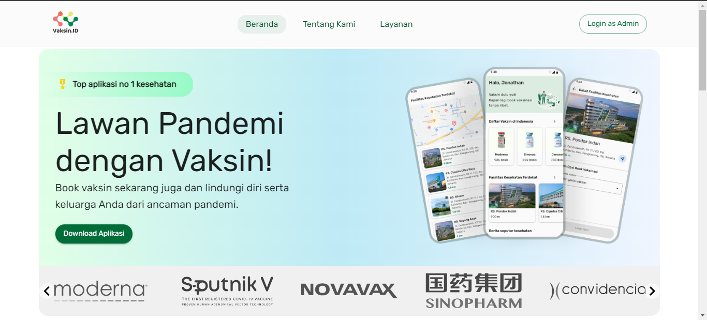
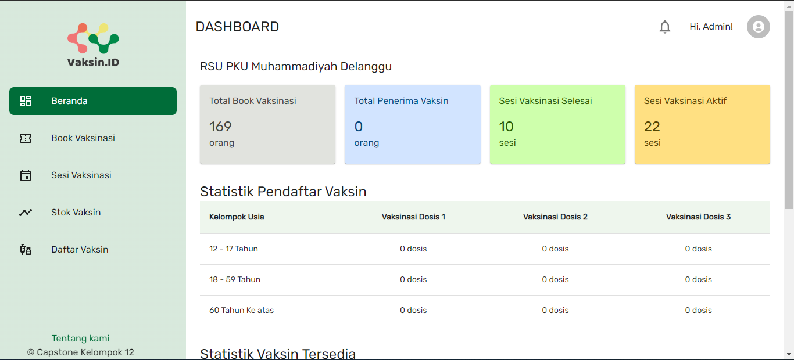
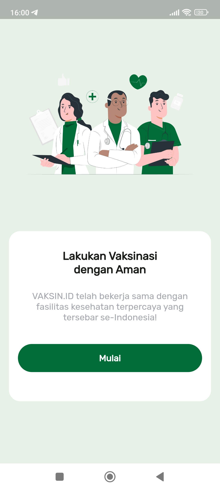
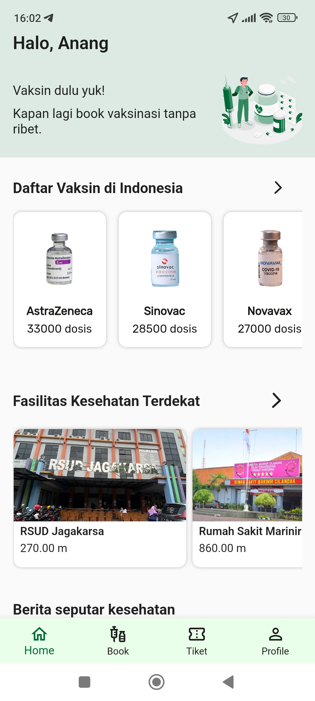

## Hi there 👋

This is our Capstone Project at Kampus Merdeka Studi Independen batch 3 at Alterra Academy. 

### MVP's

| User  | Admin |
| ----------- | ----------- |
| <ul><li>- [x] Register to the system using NIK</li>| <ul><li>- [x] Manage vaccination bookings</li> |
| <ul><li>- [x] Add their family members</li>| <ul><li>- [x] Manage sessions availability</li> |
| <ul><li>- [x] Book vaccination sessions in nearby health facilities</li>| <ul><li>- [x] Manage vaccine stocks</li> |
| <ul><li>- [x] Receive a vaccination pass to be shown in health facilities</li>| <ul><li>- [x] Vaccination Names</li> |
| <ul><li>- [x] Find nearby health facilities </li>| <ul><li>- [x] Manage User Register</li> |

### App preview

	<h4>Website</h4>
	
	 
	

	<h4>Mobile</h4>
	
	

### Meet our team

<h3 align="left">Languages and Tools:</h3>  
<h4 align="left">   UI/UX Designer
</h4>

<ol>
	<li><a href='https://dribbble.com/BANZAITESLA'>DEA INESIA SRI UTAMI</a></li>
	<li><a href='https://dribbble.com/agpras'>MUHAMAD AGUNG PRASTIYO</a></li>
	<li>TIARA AURELLIA PUTRI INSYRA</li>
	<li><a href='https://dribbble.com/Nurmasari'>NORMA SARI</a></li>
	<li>BAYU ANUGRAH PUTRA</li>
</ol>

<h4>
 Flutter Developer
</h4>

<ol>
	<li><a href='https://github.com/abghifareihand'>ABGHI FAREIHAN DESAILIE</a></li>
	<li><a href='https://github.com/AncaSea'>ANCASE REKASAE SURYO DWI RAHARJO</a></li>
	<li><a href='https://github.com/SyifaHameza'>SYIFA HAMEZA HAMID</a></li>
	<li><a href='https://github.com/NdaruDienul'>NDARU DIENUL YOGA SWORO</a></li>
	<li><a href='https://github.com/fielaazhari'>FIELA JUNITA AZHARI</a></li>
</ol>
<h4>
  Golang Developer
</h4>

<ol>
	<li><a href='https://github.com/naufal360'>AHMAD NAUFAL FADHIL</a></li>
	<li><a href='https://github.com/MGhalih'>MUHAMMAD GHALIH MAULANA</a></li>
</ol>
<h4>
 Reactjs Developer
</h4>

<ol>
	<li><a href='https://github.com/anangkf'>ANANG KHOIRUL FADLI</a></li>
	<li><a href='https://github.com/NaufalChandira'>NAUFAL HADI CHANDIRA</a></li>
	<li><a href='https://github.com/EgoSetiawan'>MUHAMMAD TEGUH SETIAWAN</a></li>
	<li><a href='#'>MAULANA</a></li>
</ol>
<h4>
 Quality Engineer
</h4>

<ol>
	<li><a href='https://github.com/DewiPutriWulandari'>DEWI PUTRI WULANDARI</a></li>
	<li><a href='https://github.com/sarahmargaretha'>SARAH MARGARETHA BR. SITUMORANG</a></li>
</ol>
